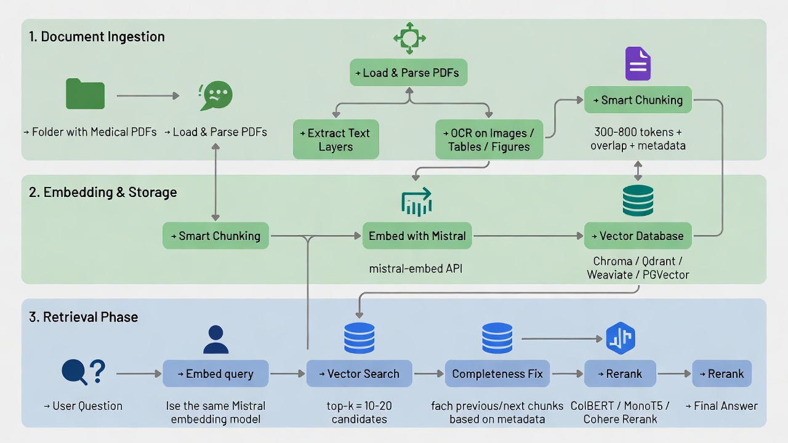

# Angetek-LLM

---
## Project Structure
```
ANGETEK-LLM/
├── apis/
│   └── routes.py
├── db_service/
│   ├── chunking.py
│   ├── embeddings/
│   ├── graph_store.py
│   ├── ingest.py
│   └── vector_store.py
├── knowledge_base/
│   ├── Data/
│   │   └── Dehydration_sensors_data/
│   |   └── extracted_images/
|   ├── neo4j/
│   |   └── (neo4j data, logs, import, plugins volumes)
|   ├── qdrant/
│   |   └── storage/                  # persistent Qdrant vector DB storage
├── models/
├── services/
│   ├── audit_logger.py
│   ├── generator.py
│   ├── justifier.py
│   └── prompt_builder.py
├── settings.py
├── config/
│   └── config.py
├── tests/
│   ├── test_justification.py
│   └── test_retrieval.py
├── .env
├── .gitignore
├── docker-compose.yml
├── LICENSE
├── main.py
├── README.md
├── requirements.txt
└── system_architecture_v0.jpg
```
---
